# HqSaham Resume

<h3>Table of content</h3>

* Apa itu HqSahamIDX [link](https://github.com/pratamawijaya/hqsaham-resume#apa-itu-hqsahamidx)
* Cara Ubah Template Chart [link](https://github.com/pratamawijaya/hqsaham-resume#template-charting)
* Analisa Spike [Link](https://github.com/pratamawijaya/hqsaham-resume#spike)
* Bonceng Saham by Pak Mansu v2 [link](https://github.com/pratamawijaya/hqsaham-resume#strategi-bonceng-asing-by-pak-man-su)
* Setup Trading Plan [link](https://github.com/pratamawijaya/hqsaham-resume#setup-trading-plan)

## Apa itu HqSahamIDX

HQSaham adalah bot telegram yang fungsinya untuk mengamati pergerakan harga saham IHSG, bot ini dapat diakses di [@HQSahamIDX_bot](https://t.me/HQSahamIDX_bot), bot ini tidak gratis, untuk pricingnya `IDR 88.000/3Bulan`

## command
- /u idx30 # potensi kenaikan saham
- strong buy /score tasum1, score tasum1,vol  lalu masing2 dilihat dengan /sinyal xxxx
- stocks to buy /tplanlist L/M/H, tdk ditampilkan bot klo hasilnya kebanyakkan
- konon saham yg dipakai asing sebagai reksa dana lebih kuat dan aman ? coba /rdftop dan /rdfval, /rdfsell
- bot bisa bantu anda menganalisa saham, coba /ac wood
- mau tau saham2 di area mantulnya ? /scr acrev, /score acrev,bofibo90;1
- saham yg banyak indikator buy.nya /scrbuy klo output kosong, coba /scrbuy kode.sektor, kode sektor liat /map, lalu coba /c xxxx O5 untuk lihat posisi support dan resistance nya atau /p xxxx, /sr xxxx
- saham yang harganya naik dan volume nya melebihi 2x rerata volume 26 hariannya ? /vspike1
- coba /map ihsg, lalu pilih misal /map kompas100
- melihat asing akumulasi /faccum tlkm, top 5 brokrer net buy /accumbd tlkm, materi 


## Cara membonceng bandar yang sopan [link](https://t.me/c/1316829255/301567)
cara membonceng bandar yang sopan:

1. ketik /BRN 10  untuk melihat 10 broker yg melakukan net buy terbesar
2. ikuti 3 broker teratas , check net buy terbesar masing2 broker tsb . 
Contoh: /NBB CC 10 untuk melihat 10 teratas belanjaan broker tsb yang netbuy
3. bila harga saat ini berada dibawah harga AVG , silakan bonceng.
4. kalau ingin melihat broker mana saja yang ikut masuk di saham tsb, 
Contoh : /BNB TLKM 10
5. Cek apakah broker tersebut baru mengakumulasi saham tersebut atau sudah berlangsung lama.
Contoh : 
/C   TLKM  i70.cc

hati-hati menjadi penumpang gelap beresiko diturunkan ditengah jalan. 😄.. bukan hanya diturunkan saja , tapi uang anda dikuras dulu baru diturunin.

## Membonceng asing [link](https://t.me/c/1316829255/294560)
makanya penting , untuk masuk bila blue chip ada di /SCR NF5D

## membonceng top 5 broker [link](https://t.me/c/1316829255/292668)
Kalau ingin ikut strategi top 5 broker, caranya adalah:
Masuk ketika pola garis biru membentuk huruf v di 2 candle pertama . Stop lossnya adlh lowest low candle 3 hari terakhir.
Kebalikannya segera keluar bila 2 candle terakhir membentuk huruf A yg diikuti penurunan harga. Bila pola huruf A terbentuk tapi malah terjadi kenaikan harga, itu artinya sedang terjadi mark up with distribution. Hold sampai terjadi lower low 2 candle berturut2

## Command broker
Sedikit nambahin

Command Broker Analysis :
(xxxx = nama saham)(zz = kode broker)

/bnb xxxx 5 : Top 5 Broker Net Buy pd saham xxxx
/bnb xxxx 10 : Top 10 Broker Net Buy pd saham xxxx
/bns xxxx 5 : Top 5 Broker Net Sell pd saham xxxx
/bns xxxx 10 : Top 10 Broker Net Sell pd saham xxxx

/nbsratio xxxx 5 :  Top 5 Broker Net Buy/Sell Ratio
/nbsratio xxxx 10 :  Top 10 Broker Net Buy/Sell Ratio

/accumbd xxxx : chart accum Broker (top 5)
/faccum xxxx : chart accum Broker asing

/bs zz b : Top 10 Buy pada Broker zz
/bs zz s : Top 10 Sell pada Broker zz

/nbb zz 10 : Top 10 Net Buy pada Broker zz
/nsb zz 10 :  Top 10 Net Sell pada Broker zz 

/brn b  : pie chart top 10 broker Net Buy
/brn 10  : pie chart top 10 broker Net Buy
/brn s : pie chart top 10 broker Net Sell
/brn s 10 : pie chart top 10 broker Net Sell

/brndom : pie chart top 10 Net Buy Broker Lokal 
/brndom s : pie chart top 10 Net Sell Broker Lokal
/brnfor : pie chart top 10 Net Buy Broker Asing 
/brnfor s : pie chart top 10 Net Buy Broker Asing

saat live : gunakan /scr nbs1  
saat eod: gunakan /scr nbs3

# Spike 
command /mfqhis xxxx untuk periode 6 hari, /mfq xxxx utk 1 hari, /fq xxxx [nBulan] defaultnya 90 days, screening /score mfqspike, /score mfqspike2, /score mfqspike3

/eq xxxx nHari max 100, default 21 hari (klo gak ditulis)

di coba saja di bot

jangan lupa baca pinned message di hq 👈

yg belum join group dz silahkan join, /tools, group donat 🍩, pilih group demand zone

atau ada yg belum join group hq, /m, ruang diskusi, lalu baca pinned message di sana

cek masa aktif /w spy jangan dilempar keluar oleh hansip dan terlewatkan info penting dari group ini

NGETIK COMMAND DI BOT, bukan di sini 😬 ke bot klik
https://t.me/hqsahamidx_bot

# Support dan Resistance
untuk mengetahui posisi support dan resistance, bisa menggunakan command **/SR xxx**

# Quick Reference :
* coba 👉 `/u, /u idxbumn20, /u lq45, /stats tlkm`
* 💪 StrongBuy `/score tasum1, score tasum1,vol  lalu cek dgn /sinyal xxxx`
* ✍️ Stocks to Buy /tplanlist L/M/H, kosong jika hasilnya kebanyakkan.
* ✈️ Stocks to Fly /hlmalert
* 🧐 konon saham yg dipakai asing sebagai reksa dana lebih kuat dan aman ? coba `/rdftop dan /rdfval, /rdfsell`
* 💰 Kepemilikkan Saham Asing: `/O bris f.2020.11`, Domestic: `/O bris d.2020.11`, coba juga `/O bris fd.2020.11` bukan dibulan berjalan.
* History: `/OT bris f.12.3` dan `/OT bris d.12.3` history selama 12 bulan, jenis kepemilikkan 3 (1-9)
* 😁 bot bisa menganalisa saham, secara pola candle (update 20:00) /ac wood secara indikator periode 14 hari /sinyal wood, sementara untuk kompas100, liat `/map kompas100`, coba juga fair value /xxxx atau `/val xxxx` lalu `/rating 5`

Saham murah ala LKH 
`/sf per>1 per<10 pbv>0 pbv<1`
* annualized data.

* 😳 saham2 di area mantulnya ? /scr acrev, /score acrev,bofibo90;1
* 🤨 saham yg banyak indikator buy.nya /scrbuy klo output kosong, coba /scrbuy kode.sektor, kode sektor liat /ix, lalu coba /c xxxx O5 untuk lihat Support dan Resistance nya atau /p xxxx, /sr xxxx
* 😱 saham yang harganya naik dan volume nya melebihi 2x rerata volume 26 hariannya ? /vspike1
* 🤓 coba /map ihsg, lalu pilih misal /map kompas100
* 🏰 melihat asing akumulasi /faccum tlkm, top 5 brokrer net buy /accumbd tlkm,

```
🚀 Tips Membonceng Bandar Yang Sopan 
       Tips Membonceng Bandar Asing  
        Membonceng Top 5 Broker 
```

* 🔎 command.2 broker https://t.me/c/1316829255/443577
* 📊 membuat chart, analisa & mencari saham `/pix mdka` baca pdf Trade With Pixel   screening `/scr gogc`, `/scr pix1` sd 9
* 🎞 video tutorial /m, video tutor
* 💵 untuk donasi 88rb/3bln, /d ikutin petunjuk yg diberikan
* 🔬cek masa aktif /w
* 🏆 apa yg didapat donatur ? #1menggunakan bot, #2mendapat Live Alert, #3mengikuti group diskusi yg membahas saham, mencari saham pilihan.  join group donatur /tools, group donatur
* 😢 error waktu join group/alert ketik /clear lalu ulangi, klo msh error, update telenya
* 💎 Tersedia apps android GRATIS dgn stock pick harian yg win ratenya tinggi, beli sore besok cuan, juga bisa mencari saham, analisa

## Template Charting
```
/dclist -> menampilkan template chart

/dcreset id_chart command -> merubah command chart

MA50,MA150,I36,O5,I40,LOG
EMA13,EMA50,EMA100,I36,I16,O5,I40,LOG

```

## Riset Bandar Asing Lagi Ngapain
```
/q 5,10 0,3 -> menampilkan saham yang diakumulasi 5-10M dengan kenaikan 0-3%
```
contoh hasilnya :

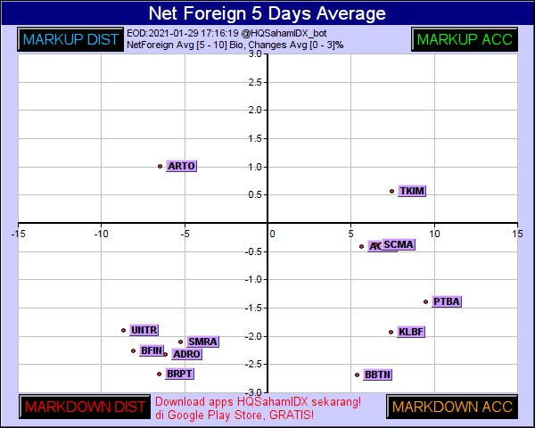

penjelasannya 
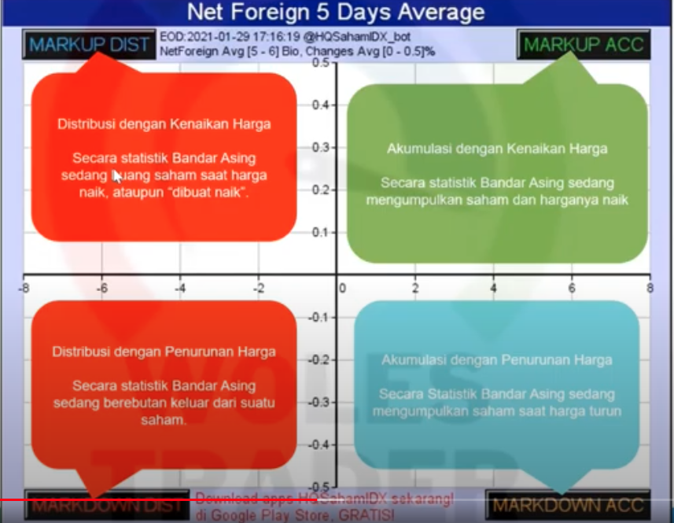

## Strategi bonceng asing by Pak Man Su

- screening dengan `/q5 30,300 0,3` tujuannya mendapatkan gambaran saham yang diakumulasi selama 5 hari dengan dana yang besar namun belum mengalami kenaikan

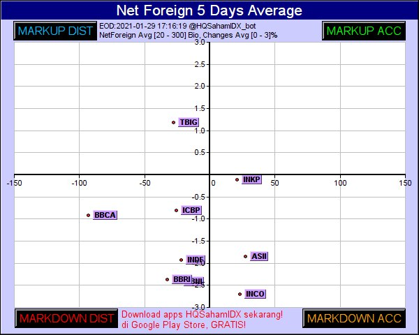

- analisa dengan perintah `/faccum <kodesaham>` untuk mengetahui harga rata2 akumulasi selama 90hari, dan trendnya perbandingan akumulasi vs distribusi

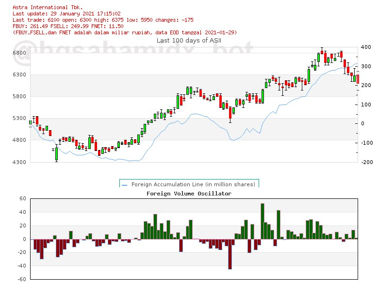

penjelasan mengenai faccum
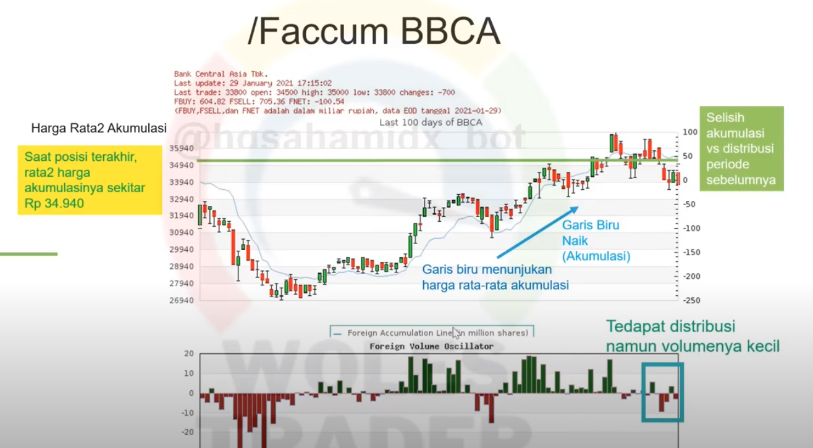

- analisa dengan `/pivot <kodesaham>` untuk mengetahui harga terakhir sudah break R1/R2/R3

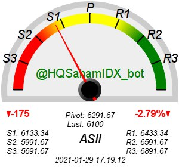

- analisa dengan command `/c <kodesaham> i42,i36,i40,z11`,
* i36 : foreign buy/sell
* i42 : volume with MA
* i40 : pixels trend, volume, momentum

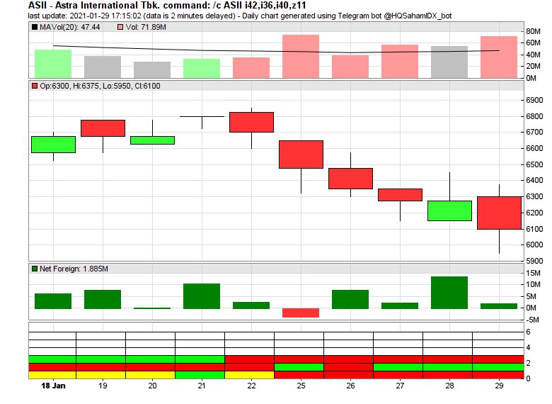

- melihat komposisi pemegang saham `/o <kodesaham> fd.2020.12`

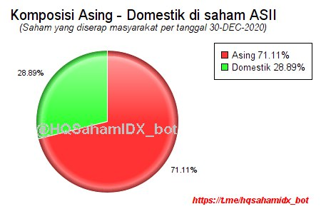

- analisa dengan vwap
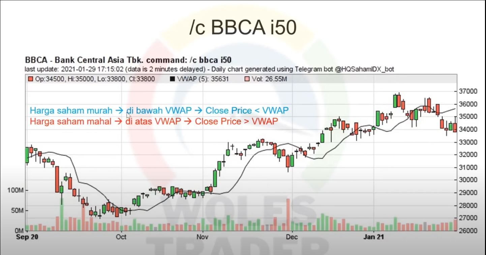

- analisa tambahan
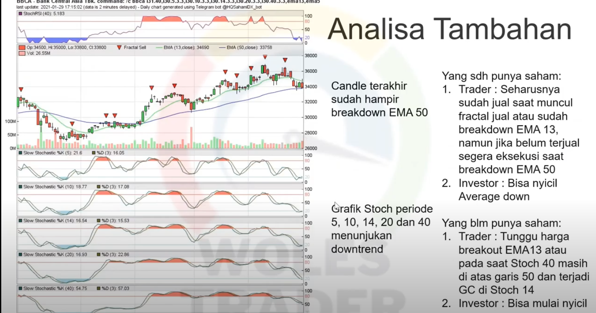

## Setup Trading Plan

- `/STP <kodesaham> <harga beli>,<stoploss>,<target price>`
- `/ltp` melihat daftar trading plan

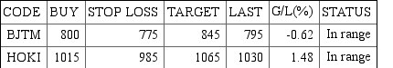

- `/dtp kodesaham` menghapus trading plan 
